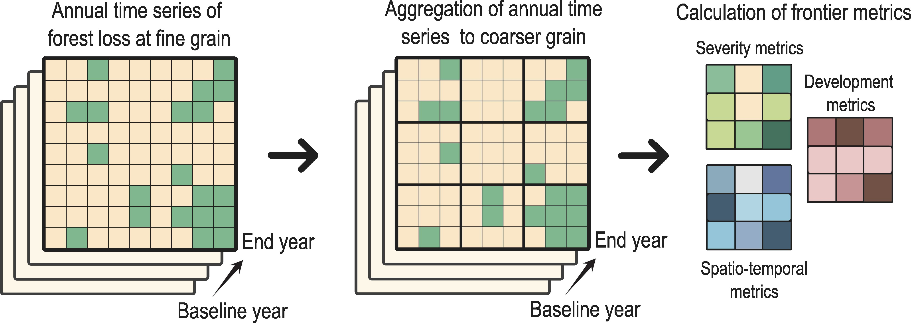
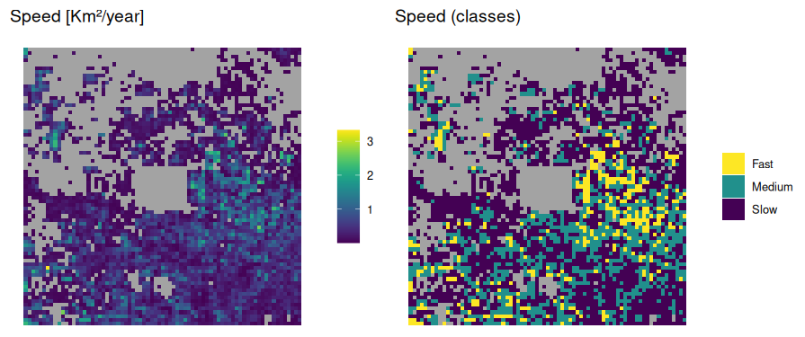
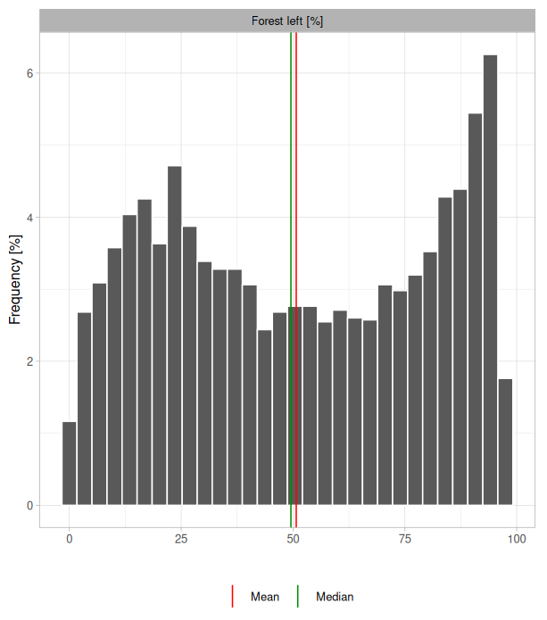

```{r, include = FALSE}
knitr::opts_chunk$set(
  collapse = TRUE,
  comment = "#>"
)
```

## Overview

Deforestation, especially in the tropics, is the leading driver of biodiversity loss worldwide, contributing to climate change as well as to the widespread degradation of nature’s contributions to people (Díaz et al., 2019). Advances in satellite imagery and processing capabilities have enabled major progress in identifying deforestation at increasingly high spatial and temporal resolution, with rapid response time, and across the globe. 

Frontier metrics (Baumann et al., 2022; Buchadas et al., 2022) have recently been developed to capture the spatio-temporal dynamics of forest loss, and have been demonstrated to characterize advancing and emerging frontiers over a period of 40 years for the South American Dry Chaco (Baumann et al. 2022) and for the world’s tropical dry woodlands globally over a 20-year period (Buchadas et al. 2020). Drawing on a more detailed analysis of time series of forest loss, frontier metrics are calculated through the aggregation of spatial data into larger units that function as small landscapes composed of individual cells:

<div style="margin-top: 25px; margin-bottom: 25px;">
```{r echo=FALSE, out.width="100%", fig.align="center"}

```
</div>

Built upon the frameworks proposed by Buchadas et al. (2022) and Baumann et al. (2022), the R package `frontiermetrics` enables the calculation of frontier metrics at any geographical extent.

## Basic usage with Global Forest Watch datasets

We first introduce the package by using the datasets from Global Forest Watch online sources (Hansen et al. 2013). In order to keep the project clea, we first create and set a directory where all generated objects will be stored.

```{r eval=F}
dir.create("copo_project")
setwd("copo_project")
```

We first download and load a polygon that will serve as a our study area for the calculation of metrics. The polygon represents a square area with Copo National Park (Argentina) in the middle of the study area.

```{r eval=F}
curl::curl_download(frontiermetrics_data[1], "copo.gpkg")
copo <- terra::vect("copo.gpkg")
```

### Downloading data with `get_gfw()`

Once the study area has been defined, we use the function `get_gfw()` to download data from Global Forest Watch (GFW) sources. This includes a raster layer of tree cover (%) in year 2000 and a raster layer of cover loss per year, from 2001 to 2024. This is a single raster layer where 0 indicates no loss, while values of 1, 2, 3, etc., represent forest loss occurring in years 2001, 2002, 2003, and so on. Both raster layers are at a resolution of ~30 meters.

```{r eval=F}
# Loading package
library(frontiermetrics)
# Downloading GFW raster layers given the provided study area
get_gfw(study_area = copo)

# Downloaded raster layers are loaded to the R environment
gfw_cover <- terra::rast("tree_cover.tif")
gfw_loss <- terra::rast("loss_year.tif")
```

### Generation of structured data with `init_fmetrics()`

Before calculating frontier metrics, raster data must be structured into a data frame with the function `init_fmetrics()`. This function receives, as main arguments, a list with raster layers of tree cover and cover loss per year; and a numeric vector in argument `time_frame` indicating the first and last year of the analyzed time frame.

```{r eval=F}
copo_dataset <- init_fmetrics(raster = list(gfw_cover, gfw_loss), time_frame = c(2000, 2024))
```

Other key arguments include:

- `min_treecover`: which depicts the minimum percentage of tree cover (in raster layer of tree cover) to be considered as "forest".
- `aggregation`: which defines how spatial data is aggregated into larger spatial units;
- `min_cover`: `min_rate`, and `window`, which indicate how deforestation frontiers are defined.

In this example (and by default), `min_treecover = 10`, `aggregation = c(10, 10)`, `min_cover = 5`, `min_rate = 0.5`, and `window = 5`. These values can be mean the following: 

- A value of 10% of tree cover will be considered as "forest" in the raster layer of tree cover provided by GFW;
- Spatial data, at a resolution of ~30 meters, is aggregated in two steps. First, cells are aggregated using the first value of the aggregation argument, which represents the number of cells to merge in each direction (horizontal and vertical). In this step, the values of forest cover of all included cells are summed, and the amount of forest loss is calculated for each new aggregated cell. Second, the newly aggregated cells are further grouped using the second value of the aggregation argument. At this stage, each cell from the initial aggregation is merged into larger cells, which will serve as the basis for calculating frontier metrics. By setting `aggregation = c(10, 10)`, we: (1) aggregate 10 cells both horizontally and vertically, and sum the values of forest cover and loss (as different calculations), producing cells of ~300m, and (2) further aggregate these newly aggregated cells by a factor of 10, generating larger cells with a resolution of ~3000m. These larger cells will be used as the basis for the calculation of frontier metrics;
- Frontiers are defined as cells that meet two criteria: (1) they have a minimum percentage of forest cover (`min_cover`) pf 5% and (2) they have a minimum average annual forest loss rate of 0.5% in a 5 consecutive years temporal windows (`min_rate`). Those cells that do not meet these criteria are not considered frontiers and thus excluded from the analysis.

See more details about these and other arguments in `?init_fmetrics`.

The function returns an object of class 'init_FrontierMetric'. Basic information about the object can be explored:

```{r eval=F}
copo_dataset
```

```
Class               : init_FrontierMetric
Time-frame          : 2000 - 2024
Fine grain (°|m)    : 0.0025 | ~277.8
Coarse grain (°|m)  : 0.0250 | ~2778
Frontier definition :
  Min. cover        : 5%
  Min. loss rate    : 0.5%
  Window size       : 5 years
```

### Calculation of metrics with `fmetrics()`

We now have available the necessary structure to calculate deforestation frontier metrics with the function `fmetrics()`. First, to maintain our project clean, we create a directory where metric's raster layers will be exported:

```{r eval=F}
dir.create("metrics_rasters")
```

The function `fmetrics()` receives an object of class 'init_FrontierMetric' (here, `copo_dataset`). The metrics to be calculated are provided in argument `metrics`:

```{r eval=F}
copo_metrics <- fmetrics(x = copo_dataset,
                         metrics = "all",
                         dir = "metrics_rasters")
```

We also define the directory of exportation for raster layers of the calculated metrics. See `?fmetrics` for details on these and other metrics, as well as other relevant arguments. In particular, the argument `params` receives specific parameters for the metrics of "activeness" and "onset". Also, the argument `breaks` receives the rules to define categorical classes for those continuous metrics, which might ease the interpretation of metric values in the study area.

If a directory is provided in argument `dir`, raster layers of metrics will be exported to this directory. If not, this function also returns an object of class 'FrontierMetric', which contains a main data frame with the calculated metrics, as well as frontier archetypes based on the calculated metrics. Frontier archetypes can be defined as the combination of different frontier metric classes that might represent a higher order of frontier classification. The exported object can be passed to other functions and facilitate the interpretation of results. This includes the function `fmetrics_rast()` to export raster layers in a later step. By simply running the object, some useful information of the object is provided:

```{r eval=F}
copo_metrics
```

```
Class               : FrontierMetric
Metrics             : baseline loss speed activeness left onset 
User-defined metrics: -
Time-frame          : 2000 - 2024
```

By specifying `"all"` in argument `metrics`, all available metrics will be calculated. The metric `loss_frag`, which calculate the maximum value of edge density (m/ha) of the woodland loss spatial pattern, is particularly computationally heavy to be calculated, and therefore time-consuming.

### Plotting and summarizing

The function `fmetrics_plot()` receives an object of class 'FrontierMetric' (here, named `copo_metrics`) and plots the metrics in the study area. By default, this includes both continuous values and categorical classes (if relevant). In addition, frontier archetypes based on the calculated metrics can be plotted.

For instance, let's plot the metric "speed":

```{r eval=F}
fmetrics_plot(copo_metrics, metrics = "speed")
```

<div style="margin-top: 25px; margin-bottom: 25px;">
```{r echo=FALSE, out.width="100%", fig.align="center"}

```
</div>

Aesthetic parameters of the plot can be customized, including the palette and background colors. See `fmetrics_plot()` for details.

The function `fmetrics_summary()` receives an object of class 'FrontierMetric' to summarize metric values. This includes an histogram for each continuous metric, basic summary statistics (such as mean, median and standard deviation), and the total area covered by each categorical class of the calculated metrics.

For instance, let's get the summary for the metric "left" (forest left):

```{r eval=F}
summ <- fmetrics_summary(copo_metrics, metrics = "left")
```

- Summary statistics (absolute values)

```
      Forest left [%]
min              0.03
max             97.46
mean            50.72
mode               NA
sd              29.75
q0.05            6.34
q0.25           23.70
q50             49.53
q75             79.54
q95             93.83

- Total area (km²) per metric class

Forest left 
    High    9417.91
    Medium  7048.54
    Low     9121.46
```

<div style="margin-top: 25px; margin-bottom: 25px;">
```{r echo=FALSE, out.width="70%", fig.align="center"}

```
</div>

Inspection of the summary can be accessed with `summ@summary_stats`, `summ@classes_areas`, and `summ@hists`.

## Advanced usage

### Custom time-series

The package has the capability of calculating frontier metrics by using a custom time-series of forest cover, besides those provided by Global Forest Watch. Custom time-series must be provided during the generation of the object 'init_FrontierMetric' with the function `init_fmetrics()`. Argument `is_series` must equal `TRUE`, and the time-series must be an object of class 'SpatRaster' with multiple layers. Each layer must be binary, representing the amount of forest cover for each consecutive year of the analyzed time series. A cell of value 1 will be considered as covered by forest, while 0 will be considered as a different cover. Alternatively, each layer of the raster series can be continuous, representing a continuous value of natural cover in km². If this is the case, argument `is_continuous` must be `TRUE`.

*The user must be cautious when using custom time-series. The available deforestation metrics were programmed to only consider the process of forest loss, whereas forest gain in each year of the time-series is not considered. In addition, the available metrics were theoretically thought to analyze the process of forest loss in tropical and subtropical forests. Any other usage for different biomes or to analyze the procces of loss of a different cover (for instance, savannas) should be carefully considered.*

### User-defined metrics

The package exhibits a modular design that allows advanced R users to program their own frontier metrics. The user must create an R function (named `ud_ ` + `metric_name `; e.g. `ud_metric1`) that would receive a unique argument `x`, an object of class 'init_FrontierMetric' generated with the function `init_fmetrics()`, work with the structured data frame within this object (available in the slot `@data`⁠) as desired, and return a data frame with the values of the metric for each individual cell.

The slot `@data` of an object of class 'init_FrontierMetric' is an object of class 'data.table' (from package `data.table`) that contains the following columns:

- 'id_cell': the id of the each individual cell for which metrics are then calculated;
- 'x_cell' and 'y_cell': the central coordinates (longitude and latitude) of the each cell;
- 'id_1', 'x_1', and 'y_1': the id of the smaller cells contained within each larger cell, and the coordinates for each one. See the argument `aggregation` of `init_fmetrics()` for details on how these smaller cells are constructed, or above in this vignette.
- 'FC_2000': the amount of forest cover in km² of each small cell contained within each larger cell in the baseline year (year 2000 by default);
- 'FL_2001', 'FL_2002', ... an so on: the amount of forest loss in km² for each small cell.

See, for example, the following function that would calculate the amount of forest cover in the baseline year, but in km²:

```
ud_baseline <- function(x){
  # Select desired column
  cols <- c("id_cell", x@initial_fc_col)
  fm_ds <- x@data[, cols, with = F]

  # Sum the value of forest cover of small cells contained within larger cells
  fm_ds <- fm_ds[, sum(.SD), .SD = x@initial_fc_col, by = id_cell]
  colnames(fm_ds)[2] <- x@initial_fc_col

  # Calculate the metric: amount of forest cover in baseline year
  fm_ds$ud_baseline <- fm_ds[[x@initial_fc_col]]

  # Order colums
  fm_ds <- fm_ds[, c("id_cell", x@initial_fc_col, "ud_baseline"), with = F]

  # Return data frame
  return(fm_ds)
}
```

The special coding of the data frames is needed because `x@data` is a data.table object, which requires its own syntax for filtering and summarizing. The following line within the programmed function is key, as data is summarized to the larger cells:

```
fm_ds <- fm_ds[, sum(.SD), .SD = x@initial_fc_col, by = id_cell]
```

This step is essential, as metrics are then calculated at the level of these cells. In this example, in the following line:

```
fm_ds$ud_baseline <- fm_ds[[x@initial_fc_col]]
```

In order to use this user-defined function, one must provide `"ud_baseline"` in argument `metrics` of the function `fmetrics()`. Note that the generation of categorical classes for user-defined metrics will not be calculated automatically, and should be accounted by the user when programming the function. User-defined metrics can also be plotted with `fmetrics_plot()` and exported when running `fmetrics()` or later with `fmetrics_rast()`. Summaries with `fmetrics_summary()` for user-defined metrics are not available.

### References

Baumann, M., Gasparri, I., Buchadas, A., Oeser, J., Meyfroidt, P., Levers, C., ... & Kuemmerle, T. (2022). Frontier metrics for a process-based understanding of deforestation dynamics. Environmental Research Letters, 17(9), 095010.

Buchadas, A., Baumann, M., Meyfroidt, P., & Kuemmerle, T. (2022). Uncovering major types of deforestation frontiers across the world’s tropical dry woodlands. Nature Sustainability, 5(7), 619-627.

Díaz, S., Settele, J., Brondízio, E. S., Ngo, H. T., Agard, J., Arneth, A., ... & Zayas, C. N. (2019). Pervasive human-driven decline of life on Earth points to the need for transformative change. Science, 366(6471), eaax3100.

Hansen, M. C., Potapov, P. V., Moore, R., Hancher, M., Turubanova, S. A., Tyukavina, A., ... & Townshend, J. R. (2013). High-resolution global maps of 21st-century forest cover change. science, 342(6160), 850-853.
