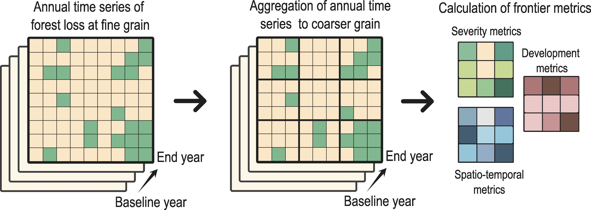
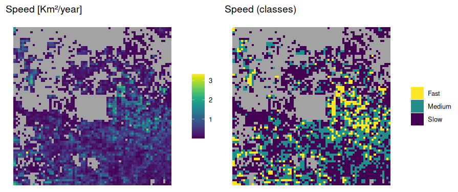
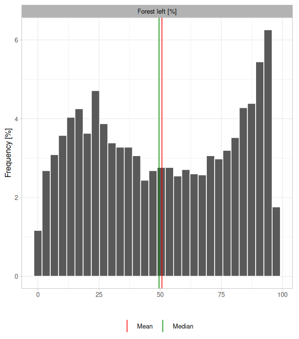
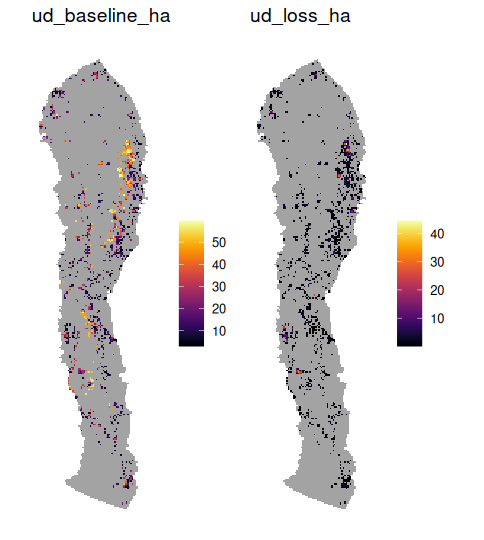

```{r, include = FALSE}
knitr::opts_chunk$set(
  collapse = TRUE,
  comment = "#>"
)
```

## Overview

Deforestation, especially in the tropics, is the leading driver of biodiversity loss worldwide, contributing to climate change as well as to the widespread degradation of nature’s contributions to people (Díaz et al., 2019). Advances in satellite imagery and processing capabilities have enabled major progress in identifying deforestation at increasingly high spatial and temporal resolution, with rapid response time, and across the globe. 

Frontier metrics (Baumann et al., 2022; Buchadas et al., 2022) have recently been developed to capture the spatio-temporal dynamics of forest loss, and have been demonstrated to characterize advancing and emerging frontiers over a period of 40 years for the South American Dry Chaco (Baumann et al. 2022) and for the world’s tropical dry forests globally over a 20-year period (Buchadas et al. 2020). Drawing on a more detailed analysis of time series of forest loss, frontier metrics are calculated through the aggregation of spatial data into larger units that function as small landscapes composed of individual cells:

<div style="margin-top: 25px; margin-bottom: 25px;">
```{r echo=FALSE, out.width="100%", fig.align="center"}

```
</div>

Built upon the frameworks proposed by Buchadas et al. (2022) and Baumann et al. (2022), the R package `frontiermetrics` enables the calculation of frontier metrics at any geographical extent.

## Frontier metrics with Global Forest Watch datasets

We introduce the package by using the datasets from Global Forest Watch (GFW) online sources (Hansen et al. 2013). In order to keep the project clean, we first create and set a directory where all generated objects will be stored.

```{r eval=F}
dir.create("intro_project")
setwd("intro_project")
```

We first download and load a polygon that will serve as a our study area for the calculation of metrics. The polygon represents a square area with *Copo National Park* (Argentina) in the middle of the study area.

```{r eval=F}
curl::curl_download(frontiermetrics_data[1], "copo.gpkg")
copo <- terra::vect("copo.gpkg")
```

We will also use a polygon delineating the region known as *Sierras Chicas*, a mountainous and forested area in the west region of the province of Córdoba, Argentina.

```{r eval=F}
curl::curl_download(frontiermetrics_data[2], "sierras_chicas.gpkg")
sierras_chicas <- terra::vect("sierras_chicas.gpkg")
```

### Downloading data with `get_gfw()`

Once the study area has been defined, we use the function `get_gfw()` to download data from GFW sources. This includes a raster layer of tree canopy cover in year 2000 and a raster layer of forest cover loss per year, from 2001 to 2024. This is a single raster layer where 0 indicates no loss, while values of 1, 2, 3, etc., represent forest loss occurring in years 2001, 2002, 2003, and so on. Both raster layers have a resolution of ~30 meters.

```{r eval=F}
# Loading package
library(frontiermetrics)
# Downloading GFW raster layers given the provided study area
get_gfw(study_area = copo)

# Downloaded raster layers are loaded to the R environment
# These files are also available online.
#    Run frontiermetrics_data[3:4] to see the links
gfw_cover <- terra::rast("tree_cover.tif")
gfw_loss <- terra::rast("loss_year.tif")
```

This particular study area has a square shape, a shape that will be inherited when calculating and plotting frontier metrics. However, this is not mandatory, and polygons of different shape are also successfully processed by `get_gfw()`, and masked to the boundaries of the study area (unless `mask = FALSE`). This is the case of the *Sierras Chicas* polygon.

```{r eval=F}
# Downloading GFW raster layers given the provided study area
get_gfw(study_area = sierras_chicas,
        filenames = c("tree_cover_sc", "loss_year_sc"))

# Downloaded raster layers are loaded to the R environment
# These files are also available online.
#    Run frontiermetrics_data[7:8] to see the links
gfw_cover_sc <- terra::rast("tree_cover_sc.tif")
gfw_loss_sc <- terra::rast("loss_year_sc.tif")
```

### Generation of structured data with `init_fmetrics()`

Before calculating frontier metrics, raster data must be structured into a special data frame with the function `init_fmetrics()`. This function receives, as main arguments, a list with raster layers of tree cover and cover loss per year; and a numeric vector in argument `time_frame` indicating the first and last year of the analyzed time frame. A tag for the object can also be defined inside argument `tag`.

```{r eval=F}
copo_dataset <- init_fmetrics(raster = list(gfw_cover, gfw_loss), 
                              tag = "Copo National Park", 
                              time_frame = c(2000, 2024))
```

Other key arguments include:

- `min_treecover`: depicts the minimum percentage of tree canopy cover to be considered as "forest" when using GFW datasets.
- `aggregation`: defines how spatial data is aggregated into larger spatial units.
- `min_cover`, `min_rate`,`window`: define how deforestation frontiers are determined.

In this example (and by default), `min_treecover = 10`, `aggregation = c(10, 10)`, `min_cover = 5`, `min_rate = 0.5`, and `window = 5`.

When `min_treecover = 10`, a value of 10% of tree cover will be considered as "forest" in the raster layer of tree cover provided by GFW.

Spatial data, at a resolution of ~30 meters in GFW datasets, is aggregated in two steps. First, cells are aggregated using the first value of the aggregation argument, which represents the number of cells to merge in each direction (horizontal and vertical). In this step, the values of forest cover of all included cells are summed, and the amount of forest loss is calculated for each new aggregated cell. Second, the newly aggregated cells are further grouped using the second value of the aggregation argument. At this stage, each cell from the initial aggregation is merged into larger cells, which will serve as the basis for calculating frontier metrics. By setting `aggregation = c(10, 10)`, the option by default, we: (1) aggregate 10 cells both horizontally and vertically, and sum the values of forest cover and loss (as different calculations), producing cells of ~300m, and (2) further aggregate these newly aggregated cells by a factor of 10, generating larger cells with a resolution of ~3000m. These larger cells will be used as the basis for the calculation of frontier metrics.

Frontiers are defined as cells that meet two criteria: (1) they have a minimum percentage of forest cover (`min_cover`), which is 10% by default, and (2) they have a minimum average annual forest loss rate of, by default, 0.5% (`min_rate`) in a 5 consecutive years temporal windows (`window = 5`). Those cells that do not meet these criteria are not considered frontiers and thus excluded from the analysis.

See more details about these and other arguments in `?init_fmetrics`.

The function returns an object of class 'init_FrontierMetric'. Basic information about the object can be explored:

```{r eval=F}
copo_dataset
```

```
Class               : init_FrontierMetric
Tag                 : Copo National Park
Extent              : -62.823 -60.948 -26.742 -24.867 
Time-frame          : 2000 - 2024
Fine grain (°|m)    : 0.0025 | ~277.8
Coarse grain (°|m)  : 0.0250 | ~2778
Frontier definition :
  Min. cover        : 5%
  Min. loss rate    : 0.5%
  Window size       : 5 years
```

Let's generate a different structured dataset using the *Sierras Chicas* study area:

```{r eval=F}
sc_dataset <- init_fmetrics(raster = list(gfw_cover_sc, gfw_loss_sc), 
                            tag = "Sierras Chicas",
                            min_treecover = 5,
                            aggregation = c(3, 10),
                            time_frame = c(2010, 2024),
                            min_rate = 0.25,
                            window = 3)

sc_dataset
```
```
Class               : init_FrontierMetric
Tag                 : Sierras Chicas
Extent              : -64.719 -64.141 -32.673 -30.34 
Time-frame          : 2010 - 2024
Fine grain (°|m)    : 7e-04 | ~83.3
Coarse grain (°|m)  : 0.0075 | ~833.4
Frontier definition :
  Min. cover        : 5%
  Min. loss rate    : 0.25%
  Window size       : 3 years
```

Setting `aggregation = c(3, 10)` defines a finer spatial grain: approximately 83.3 m resolution for the small cells that compose frontiers, while frontiers themselves are delineated at approximately 833.4 m. In addition, a 15-year time window is specified (`time_frame = c(2010, 2024)`). Finally, compared to the previous example, a more relaxed frontier definition is adopted by requiring an average minimum forest loss rate of 0.25% (`min_rate = 0.25`) sustained over 3 years (`window = 3`).

### Calculation of metrics with `fmetrics()`

We now have the necessary structure to calculate deforestation frontier metrics with the function `fmetrics()`. First, to maintain our project clean, we create a sub-directory where metric raster layers will be exported:

```{r eval=F}
dir.create("metrics_rasters")
```

The function `fmetrics()` receives an object of class 'init_FrontierMetric' (here, `copo_dataset`). The metrics to be calculated are provided in argument `metrics`, and raster layers of the calculated metrics will be exported to the path provided in argument `dir`:

```{r eval=F}
copo_metrics_v2 <- fmetrics(x = copo_dataset,
                            metrics = c("baseline", 
                                     "loss", 
                                     "left", 
                                     "activeness",
                                     "onset",
                                     "speed"),
                            dir = "metrics_rasters")
```

By simply running the object, some useful information of the object is provided:

```{r eval=F}
copo_metrics_v2
```

```
Class               : FrontierMetric
Tag                 : Copo National Park
Extent              : -62.823 -60.948 -26.742 -24.867 
Time-frame          : 2000 - 2024
Metrics             : baseline: 5.24, 100, 83.8    (min, max, mean)
                      loss    : 2.54, 99.78, 41.3  (min, max, mean)
                      speed   : 0, 3.33, 0.41      (min, max, mean)
                      left    : 0.03, 97.46, 50.72 (min, max, mean)
                      onset   : 2001, 2024, 2001   (min, max, mode)
                      activeness
User-defined metrics: -
```

The assigned tag is provided, as well as the extent of the study area and the evaluated time-frame. In addition, minimum, maximum, and mean values of the calculated values of metrics is also provided. Note that no statistics are provided for activeness, as this is conceptually a categorical metric. Full access to more summary statistics can be accessed through `@summary`.

```{r eval=F}
copo_metrics_v2@summary
```

See `?fmetrics` for details on these and other metrics, as well as other relevant arguments. In particular, the argument `params` receives specific parameters for "activeness" and "onset" metrics. The level of frontier activeness will depend on the temporal windows where the frontier was active along the time-frame. Temporal windows can be visualized, before calculating frontiers, by inspecting the slot `@temporal_windows` of the object of class 'init_FrontierMetric' generated with the function `init_fmetrics()`.

```{r eval=F}
copo_dataset@temporal_windows
```

```
   window first_year last_year
1       1       2001      2005
2       2       2002      2006
3       3       2003      2007
4       4       2004      2008
5       5       2005      2009
6       6       2006      2010
7       7       2007      2011
8       8       2008      2012
9       9       2009      2013
10     10       2010      2014
11     11       2011      2015
12     12       2012      2016
13     13       2013      2017
14     14       2014      2018
15     15       2015      2019
16     16       2016      2020
17     17       2017      2021
18     18       2018      2022
19     19       2019      2023
20     20       2020      2024
```

By default, activeness categories are automatically classified by an internal algorithm into "active", "emerging", or "old". This categorization can be changed by the user. For instance, two categories could be defined: "active" or "emerging", at specific temporal windows: `activeness_levels = list(active = 1:15, emerging = 16:20)`.

A key parameter named `onset_min_years` of the onset metric can also be changed. By default, onset is defined as the first year in the time series in which a frontier exhibits forest loss for 3 consecutive years. This criterion can be made more stringent by increasing the required number of consecutive years. For example, to 5 years instead of 3, by setting `onset_min_years = 5`. Let's run `fmetrics()` with these new parameters:

```{r eval=F}
copo_metrics_v3 <- fmetrics(x = copo_dataset,
                            metrics = c("activeness", "onset"),
                            params = list(activeness_levels = list(active = 1:15, emerging = 16:20),
                                          onset_min_years = 5))
```

Also, the argument `breaks` receives the rules to define categorical classes for continuous metrics, which might ease the interpretation of metric values in the study area. By default, the Jenks natural breaks classification is used to classify all naturally continuous metrics, which can be inspected by running `breaks_rules()`:

```
Rules to define frontier metrics' classes

- Baseline forest [%]: jenks 
- Baseline fragmentation [m/ha]: jenks 
- Forest loss [%]: jenks 
- Forest loss fragmentation [m/ha]: jenks 
- Speed [km²/year]: jenks 
- Forest left [%]: jenks
```

A new set of rules can be defined by the user, either automatically or manually. If a different automatic classification is chosen, the user can choose between "jenks" (default), "equal" or "quantile". Otherwise, a manual classification can be chosen. For instance, for baseline forest, one could choose three categories (low, medium, and high), and provide unique cut points:

```{r eval=F}
breaks_1 <- breaks_rules(baseline = list(c(5, 20, 70, Inf), c("Low", "Medium", "High")))
```

The new object has the class 'FrontierMetric_breaks', and can be inspected:

```{r eval=F}
breaks_1
```

```
Rules to define frontier metrics' classes

- Baseline forest [%]: 
    Low (5,20]
    Medium (20,70]
    High (70,Inf] 
- Baseline fragmentation [m/ha]: jenks 
- Forest loss [%]: jenks 
- Forest loss fragmentation [m/ha]: jenks 
- Speed [km²/year]: jenks 
- Forest left [%]: jenks
```

As shown, new categories are defined for the baseline metric, while the rest of the metrics keep the "jenks" classification by default. This new object can be passed to `fmetrics()`, inside the argument `breaks`, to generate frontier metrics classes with a new definition:

```{r eval=F}
copo_metrics_v4 <- fmetrics(x = copo_dataset,
                            metrics = "baseline",
                            breaks = breaks_1)
```

If argument `dir` is not provided with a path to an exporting directory, this function also returns an object of class 'FrontierMetric', which contains a main data frame with the calculated metrics, as well as frontier archetypes based on the calculated metrics. Frontier archetypes can be defined as the combination of different frontier metric classes that might represent a higher order of frontier classification.

The exported object can be passed to other functions and facilitate the interpretation of results. This includes the function `fmetrics_rast()` to export raster layers in a later step. Exportation will be automatically done if a path to a directory is provided when running `fmetrics()`.

By specifying `"all"` in argument `metrics`, all available metrics will be calculated. The metric `loss_frag`, which calculate the maximum value of edge density (m/ha) of the forest loss spatial pattern, is particularly computationally heavy to be calculated, and therefore time-consuming. Parallelization is possible, by defining 2 or more cores in argument `ncores`.

### Plotting and summarizing

The function `fmetrics_plot()` receives an object of class 'FrontierMetric' (here, named `copo_metrics`) and plots the metrics in the study area. By default, this includes both continuous values and categorical classes (if relevant). In addition, frontier archetypes based on the calculated metrics can be plotted.

For instance, let's plot the metric "speed":

```{r eval=F}
fmetrics_plot(copo_metrics_v2, metrics = "speed")
```

<div style="margin-top: 25px; margin-bottom: 25px;">
```{r echo=FALSE, out.width="100%", fig.align="center"}

```
</div>

Aesthetic parameters of the plot can be customized, including the palette and background colors. See `fmetrics_plot()` for details.

The function `fmetrics_summary()` receives an object of class 'FrontierMetric' to summarize metric values. This summary is also automatically calculated when running `fmetrics()`, if argument `summary = TRUE` (the default option). The summary includes an histogram for each continuous metric, basic summary statistics (such as mean, median and standard deviation), and the total area covered by each categorical class of the calculated metrics.

For instance, let's get the summary for the metric "left" (forest left):

```{r eval=F}
summ <- fmetrics_summary(copo_metrics_v2, metrics = "left")
summ
```

```
- Summary statistics (absolute values)

      Forest left [%]
min              0.03
max             97.46
mean            50.72
mode               NA
sd              29.75
q0.05            6.34
q0.25           23.70
q50             49.53
q75             79.54
q95             93.83

- Total area (km²) per metric class

Forest left 
    High    9417.91
    Medium  7048.54
    Low     9121.46
```

<div style="margin-top: 25px; margin-bottom: 25px;">
```{r echo=FALSE, out.width="70%", fig.align="center"}

```
</div>

Inspection of the summary can be accessed with `summ@summary_stats`, `summ@classes_areas`, and `summ@hists`.

## Advanced usage

### Custom time-series

The function `init_fmetrics()` can also receive a custom cover series, besides GFW datasets. For example, let's download and work with a pre-processed cover series from MapBiomas (MapBiomas Chaco Project):

```{r eval=F}
# Study area extent
study_area <- terra::ext(-61.86 - 0.36,-61.86 + 0.36,
                         -25.81 - 0.36, -25.81 + 0.36)
study_area <- terra::as.polygons(study_area)
terra::crs(study_area) <- "EPSG:4326"

curl::curl_download(frontiermetrics_data[6], "cover_series.tif")
# Loads raster layers of time-series
cover_series <- terra::rast("cover_series.tif")
# Crops cover series to study area extent
cover_series <- terra::crop(cover_series, study_area)
```

This is a binary cover series (1: forest; 0: other covers) of 24 individual raster layers, starting in 2000 and ending in 2023. This cover series can be inputted in argument `raster`:

```{r eval=F}
copo_dataset <- init_fmetrics(raster = cover_series,
                              tag = "Copo National Park - MapBiomas",
                              is_series = TRUE,
                              is_continuous = FALSE,
                              aggregation = c(3, 10),
                              time_frame = c(2000, 2023))
```

Because a cover time series is provided as input, `is_series` must be set to `TRUE`. Additionally, since the raster layers are binary, `is_continuous` must be set to `FALSE`. Alternatively, a cover series composed of continuous forest-cover values in km² may be supplied. In that case, `is_continuous` must be set to `TRUE`.

*The user must be cautious when using custom time-series. The available deforestation metrics were programmed to only consider the process of forest loss, whereas forest gain in each year of the time-series is not considered. In addition, the available metrics were theoretically thought to analyze the process of forest loss in tropical and subtropical forests. Any other usage for different biomes or to analyze the procces of loss of a different cover (for instance, savannas) should be carefully considered.*

### User-defined metrics

The package has a modular design that allows advanced R users to program their own frontier metrics. In this line, the function `fmetrics()` can also accept user-defined metrics. Implementing this functionality requires a thorough understanding of the structure of an 'init_FrontierMetric object', generated by `init_fmetrics()`. This object stores the information necessary to compute frontier metrics.

The slot `@data` contains the primary dataset used for metric calculation. The most relevant columns are:

- id_cell: identifier of each cell at the spatial level where frontiers are delineated.
- x_cell, y_cell: central coordinates of each frontier cell.
- id_1: identifier of each individual (finer-resolution) cell nested within a frontier cell. See the argument `aggregation` of `init_fmetrics()` for details on how these smaller cells are constructed, or above in this vignette.
- x_1, y_1: central coordinates of each finer-resolution cell.
- FC_+year_0: forest cover (km²) in each finer-resolution cell for the baseline year of the time frame.
- FL_+year_1, FL_+year_2, ..., FL_+year_n: forest loss (km²) in each finer-resolution cell for each consecutive year within the defined time frame.

See the help of `init_FrontierMetric-class` for more details on each slot of this class of object.

To calculate user-defined metrics, a function must be programmed. The name of the function must start with 'ud_'. It must receive, in a unique argument named `x`, an object of class `init_FrontierMetrirc`. Then, depending on the user's needs, the function must work with the structured dataset within this object and return a data.frame (or a data.table) with the values of the metric for each individual cell: one column for the identity of the cell and a second column with the values of the metric. The name of the column containing the values of the metric must start with 'ud_'.

For example, the following function calculates the amount of forest in the baseline year, in hectares (the default metric calculates this metric as a percentage relative to the total frontier area):

```{r eval=F}
ud_baseline_ha <- function(x){
  # Select desired column
  cols <- c("id_cell", x@initial_fc_col)
  fm_ds <- x@data[, cols, with = F]

  # Sum the value of forest cover of small cells contained within larger cells
  fm_ds <- fm_ds[, sum(.SD), .SD = x@initial_fc_col, by = id_cell]
  colnames(fm_ds)[2] <- x@initial_fc_col

  # Calculates the amount of forest cover in baseline year, in hectares
  fm_ds$ud_baseline_ha <- fm_ds[[x@initial_fc_col]] * 100

  # Order colums
  fm_ds <- fm_ds[, c("id_cell", "ud_baseline_ha"), with = F]

  # Return data frame
  return(fm_ds)
}
```

The special coding of the datasets within the function is needed because `x@data` is a data.table object from the package `data.table`, which requires its own syntax for filtering and summarizing. The following line within the programmed function is key, as data is summarized to the larger cells:

```{r eval=F}
fm_ds <- fm_ds[, sum(.SD), .SD = x@initial_fc_col, by = id_cell]
```

The following function calculates the amount of forest loss, in hectares (the default metric calculates this metric in percentage points relative to the initial forest cover in baseline year):

```{r eval=F}
ud_loss_ha <- function(x){
  # Sums forest loss (squared km) of individual, finer cells for each frontier
  fm_ds <- x@data[, lapply(.SD, sum, na.rm = TRUE),
                  by = id_cell,
                  .SDcols = x@fl_cols]
  
  # Calculates de cumulative forest loss in hectares
  # The name of the metric (column of the dataset) must start with "ud_"
  fm_ds$ud_loss_ha <- rowSums(fm_ds[, 2:ncol(fm_ds)]) * 100

  # Filters colums, including the identity of the cell and the metric itself
  fm_ds <- fm_ds[, c("id_cell", "ud_loss_ha"), with = F]

  # Returns dataset
  return(fm_ds)
}
```

We now calculate this metrics for the "Sierras Chicas" dataset:

```{r eval=F}
sc_metrics <- fmetrics(x = sc_dataset, metrics = c("ud_baseline_ha", "ud_loss_ha"))
sc_metrics
```

```
Class               : FrontierMetric
Tag                 : Sierras chicas
Extent              : -64.719 -64.141 -32.673 -30.34 
Time-frame          : 2010 - 2024
Metrics             : -
User-defined metrics: ud_baseline_ha ud_loss_ha 
```

Plotting of user-defined metrics is also available:

```{r eval=F}
fmetrics_plot(sc_metrics, palette = "inferno")
```

<div style="margin-top: 25px; margin-bottom: 25px;">
```{r echo=FALSE, out.width="50%", fig.align="center"}

```
</div>

Note that the generation of categorical classes for user-defined metrics will not be calculated automatically, and should be accounted by the user when programming the function. User-defined metrics can also be exported when running `fmetrics()` or later with `fmetrics_rast()`. Summaries with `fmetrics_summary()` for user-defined metrics are not available.

### References

Baumann, M., Gasparri, I., Buchadas, A., Oeser, J., Meyfroidt, P., Levers, C., ... & Kuemmerle, T. (2022). Frontier metrics for a process-based understanding of deforestation dynamics. Environmental Research Letters, 17(9), 095010.

Buchadas, A., Baumann, M., Meyfroidt, P., & Kuemmerle, T. (2022). Uncovering major types of deforestation frontiers across the world’s tropical dry woodlands. Nature Sustainability, 5(7), 619-627.

Díaz, S., Settele, J., Brondízio, E. S., Ngo, H. T., Agard, J., Arneth, A., ... & Zayas, C. N. (2019). Pervasive human-driven decline of life on Earth points to the need for transformative change. Science, 366(6471), eaax3100.

Hansen, M. C., Potapov, P. V., Moore, R., Hancher, M., Turubanova, S. A., Tyukavina, A., ... & Townshend, J. R. (2013). High-resolution global maps of 21st-century forest cover change. science, 342(6160), 850-853.

MapBiomas Chaco Project – Collection 5.0 of annual land cover and land use maps, accessed on 2025 via link: https://chaco.mapbiomas.org/
